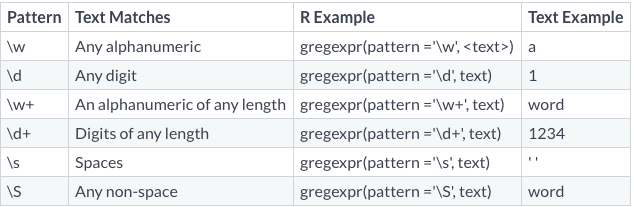
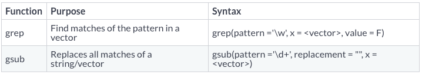

# Setup and introduction

Link for google colab:

Link for github: 

This project is made to be read in html, so open the html file in your preferred webbrowser. As standard the code is hidden in this document, but you can show all by pressing the button "Code" in the top right of the document. You can also show individual chunks of code by pressing the buttons "Code" which are placed around in the document. 

I set my knitr functions. 
```{r}
### Knitr options
knitr::opts_chunk$set(warning=FALSE,
                     message=FALSE,
                     fig.align="center"
                     )

options(warn=-1) # Hides all warnings, as the knitr options only work on local R-Markdown mode. 

Sys.setenv(LANG = "en")
```

I load my packages. 
```{r}
library(knitr) # For knitr to html
library(rmarkdown) # For formatting the document
library(tidyverse) # Standard datasciewnce toolkid (dplyr, ggplot2 et al.)
library(magrittr) # For advanced piping (%>% et al.)
library(ggraph) # For ggplot2 style graph plotting
library(kableExtra) # Formatting for tables
library(data.table) # for reading in data ect. 

library(tidytext) # Structure text within tidyverse
library(topicmodels) # For topic modelling
library(tm) # text mining library
library(quanteda) # for LSA (latent semantic analysis)
library(uwot) # for UMAP
library(dbscan) # for density based clustering

# I set a seed for reproduciability
set.seed(123) # Have to be set every time a rng proces is being made. 
```

# Preprocessing and vectorization
Justify your choices and explain possible alternatives (e.g. removing stopwords, identifying bi/tri-grams, removing verbs or use of stemming, lemmatization etc.)

Create a bag-of-words representation, apply TF-IDF and dimensionality reduction (LSA-topic modelling) to transform your corpus into a feature matrix.
Train a word-embedding model of your choice (Word2Vec, GloVe or Fasttext) and use it to calculate average-vector-representations for the tweets.

I load my data. 
```{r}
data_raw <- as_tibble(fread("https://transfer.sh/Zgwhy/twitter_hate_speech.csv"))
colnames(data_raw) <- c("ID", "class", "tweet")
```

Now i try to understand the structure of my data. 
```{r}
head(data_raw, 3)
dim(data_raw)
```
The first column is just a row number ID, that start at 0 index. Second column is the class which is formatted as 0 - hate speech, 1 - offensive language, 2 - neither, which have been labelled by a human. The third column is the tweet text. In total there is 24.783 tweets.  

## Tokenizing by word

First we will tokenize the data by word in a tidy format, to just do some simple analysis about word counts and model som topics. We will here treat the text as a "bag-of-words" where we don't care about the sequence of words. We now have tibble, where each row shows the tweet nr. and a single token. As this is a collection of documents this is called a corpus. 

```{r}
data_tidy <- data_raw %>% 
  unnest_tokens(output = word, input = tweet)
head(data_tidy, 6)
```

Here i have just printed the first 6 rows, and as you can see there is many words that does not cary any semantic meaning by themselves such as "a" or "you" and ect. So here we want to remove suh words by implementing stopwords, so that we only have words that carry semantic meaning by themselves. We now first now remove the most common stopwords by doing a anti join with a stopwords dictionary and also removing some custom stopwords. The custom stopwords are leftovers from the twitter format such as http, but also words i have manually choosen by going through the topwords. 

We also do a bit of general cleaning, in this case removing all special characters, numbers and 1-letter words. This is because these are very contextual and does not really carry meaning in themselves.

```{r}
own_stopwords <- tibble(word= c("http"),
                        lexicon = "OWN")

data_tidy_clean <- data_tidy %>% 
  anti_join(stop_words %>% bind_rows(own_stopwords), by = "word")

tweets_tidy <- data_tidy_clean %>%
  mutate(word = word %>% str_remove_all("[^[:alnum:]]") ) %>%
  mutate(word = word %>% str_remove_all("[[:digit:]]") ) %>% 
  filter(str_length(word) > 1)
```

I do now create a topwords tibble, by counting up all of the words and see what is the most popular. This can now be plotted to vizualise the top words. 
```{r}
topwords <- tweets_tidy %>% 
  count(word, sort = TRUE)

topwords %>%
  top_n(20, n) %>%
  ggplot(aes(x = word %>% fct_reorder(n), y = n)) +
  geom_col() +
  coord_flip() +
  labs(title = "Word Counts",
       x = "Frequency",
       y = "Top Words")
```
As we might expect there is a lot of swear words in these tweets. Also there might be a lot slang words and different variations of the same words, as this is a tendency on the internet and especially twitter where you are more limited in the amount of text. 

## TF-IDF

## Latent semantic analysis (LSA)
We will now perform a LSA, which is less helpful for finding human interpretable topics, but way more stable when attempting to do a dimensionality reduction as preprocessing for supervised ML workflows, or for visualization.

We first create a document-feature matrix. 

```{r}
tweets_dfm <- tweets_tidy %>% 
  count(ID, word) %>% 
  cast_dfm(document = ID, term = word, value = n)

tweets_dfm
```

From there, we can directly execute a LDA with the quanteda function textmodel_lsa. We here set the nd argument to 5, which is the amount of dimensions to be included in the output. 

```{r}
tweets_lsa <- tweets_dfm %>%
  textmodel_lsa(nd = 5)

tweets_lsa_loading <- tweets_lsa$docs %>%
  as.data.frame() %>%
  rownames_to_column(var = "ID") %>%
  as_tibble()

tweets_lsa_umap <- umap(tweets_lsa_loading %>% 
                        column_to_rownames("ID"),
                        n_neighbors = 15,
                        metric = "cosine",
                        min_dist = 0.01,
                        scale = TRUE,
                        verbose = TRUE, n_threads = 8)

tweets_lsa_umap <- tweets_lsa_umap %>% as.data.frame()
```

Now we can make a plot of the LSA map. 
```{r}
tweets_lsa_umap %>%
  ggplot(aes(x = V1, y = V2)) +
  geom_point(shape = 21, alpha = 0.5)
```

```{r}
tweets_lsa_hdbscan <- tweets_lsa_umap %>% as.matrix() %>% hdbscan(minPts = 500)
```


# Basic concepts notes

**NLP**: Natural language processing. How to analyze and understand text. 

**Tokenizing**: Is creating a bag of words. Words in a document are independent. Every seperate body of text is a document. Every unique word is a term. Every occurence of a term is a token. We use the fun: "unnest_tokens". We now have tibble, where each row shows the document and a single token. A collection of documents is called a corpus. 

**Stopwords**: Word that gives structure, but does not have other meaning in themselves. Ex. The, at, and, ect. We remove them by using fun "anti_join", and feeding it the the tibble and all of the stopwords it should remove. 

**Regular expressions**: A sequence of characters used to search text. 

**Word counts**: We often count the number of tokens to count words and plot it to extract some meaning thereoff. 

**Sentiment dictionaries**: We can use different dictionaries where words are labelled with some "sentiment". There can be many different sentiments: positive, negative, fear, joy ect. It can also be ordinal scaled from ec. -5 to 5 for very negative to very positive. Dictionaries does not label all words, and you can therefore use several dictionaries at once, but they all have their specific purpose. You can also add custom words for specific analysis. 

**Topics**: We can use unsupervised machinelearning (similar to clustering) to find topics. It searches for patterns within words. It then calculates probabilities that words will occur together. Based on discrete variables (the word counts). Every document is a misture (partial member) of every topic. 

When we want to search in text we need the correct syntax. 






As seen below in the code you properly need to use double backslash. 
```{r}
# When using grep(), setting value = TRUE will print the text instead of the indices.
# You can combine patterns such as a digit, "\\d", followed by a dot "\\.", with "\\d\\."
# You can search for a word by simply using the word as your pattern. pattern = 'word'
```


